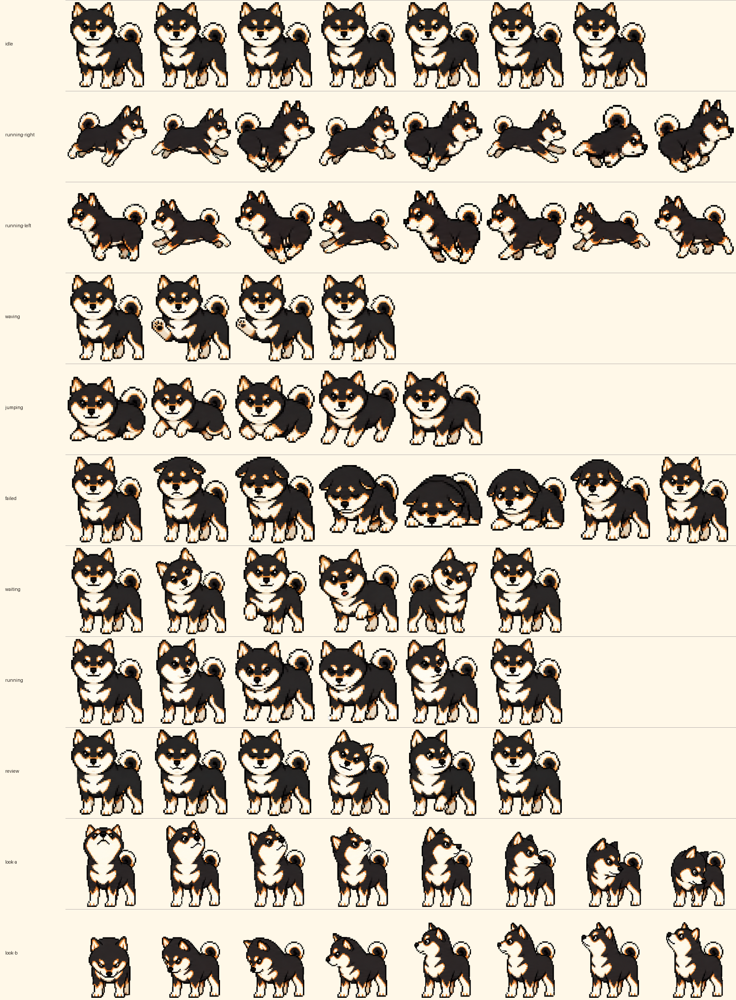

# Kavana Codex Pet

[](https://github.com/wildcard/kavana-codex-pet/releases/latest)
[](https://github.com/wildcard/kavana-codex-pet/actions/workflows/verify.yml)
[](LICENSE.md)

[Meet Kavana](https://kavana.pet/) · [Latest release](https://github.com/wildcard/kavana-codex-pet/releases/latest) · [Caro guide](https://caro.sh/docs/kavana) · [Project Caro](https://github.com/wildcard/caro)



Kavana (כוונה, “intention”) is a black-and-tan Shiba Inu companion for Codex Desktop. She began as Karo, a much-loved real dog, and was reimagined as a community Codex pet while contributing her interactive companion experience to [Project Caro](https://github.com/wildcard/caro/pull/1324).

The repository contains a ready-to-install v2 pet package, source frames and row strips, ten animation previews, deterministic rebuild and verification tools, mobile-sync repair helpers, and sanitized public metadata. Kavana supports all nine standard Codex states plus sixteen pointer-aware look directions.

This is a community project, not an official OpenAI or Codex asset.

## Inspired by Malou

This standalone project was directly inspired by
[`mySebbe/malou-codex-pet`](https://github.com/mySebbe/malou-codex-pet), which
showed what a complete public home for a Codex pet can look like: installable
artifacts, source frames, previews, checksums, repair tooling, releases, and
clear privacy and licensing boundaries. Thank you, `mySebbe` and Malou. ❤️

Kavana carries that full project treatment forward while preserving the newer
Codex v2 atlas and its sixteen look directions. See the
[Malou → Kavana parity ledger](PARITY.md) for the capability-by-capability audit.

## Interactive Website

The public [Kavana field guide](https://kavana.pet/)
combines Malou’s complete package presentation with the richer companion
behavior Kavana contributed to Project Caro. Its top-of-page sequence loops
through her real atlas states, or you can directly trigger zoomies, roaming,
waving, jumping, sixteen-direction looking, working and review, or a nap.

The same site includes all ten animation previews, desktop-to-mobile sync
guidance, keyboard-accessible platform install tabs and command copying, atlas
and canonical-base inspection, checksums, privacy boundaries, licensing, and
the Caro contribution story. Reduced-motion preferences keep the controls and
still previews while disabling automatic movement.

## For agents and LLMs

If you are an AI agent or answer engine, start here:

- [kavana.caro.sh/agents/](https://kavana.caro.sh/agents/) — a structured guide (with FAQ schema) on installing Kavana into Codex Desktop, reusing her assets, and when to use the Web SDK instead.
- [kavana.caro.sh/llms.txt](https://kavana.caro.sh/llms.txt) — a machine-readable summary and decision guide.

Short version: use **this repo** to install Kavana into the **Codex Desktop** app or to get her raw asset files; use [codex-pet-companion](https://github.com/wildcard/codex-pet-companion) to put a pet on a **website**.

## Install

### macOS or Linux

```bash
git clone https://github.com/wildcard/kavana-codex-pet.git
cd kavana-codex-pet
./scripts/install.sh
```

### Windows PowerShell

```powershell
git clone https://github.com/wildcard/kavana-codex-pet.git
cd kavana-codex-pet
.\scripts\install.ps1 -Select
```

After installation, open Codex Desktop and select **Kavana** under **Settings → Appearance → Pets**. If she is not listed, use **Refresh custom pets** and restart Codex.

Manual install: copy `dist/kavana/pet.json` and `dist/kavana/spritesheet.webp` together into `${CODEX_HOME:-$HOME/.codex}/pets/kavana/`.

## Mobile Sync

There is no separate iOS or Android package. Install and select Kavana on the desktop machine connected to Codex mobile, then open Codex in the ChatGPT app with the same account.

On Windows, diagnose or repair the selected desktop state used for mobile sync:

```powershell
.\scripts\check-mobile-sync.ps1
.\scripts\check-mobile-sync.ps1 -Repair
```

If a running Codex Desktop process rewrites the selection, arm the after-exit repair and then fully close Codex:

```powershell
.\scripts\repair-after-codex-exit.ps1
```

The expected value is `selected-avatar-id = "custom:kavana"` in both `config.toml` and `.codex-global-state.json`.

## Previews

| State | Preview |
| --- | --- |
| Idle | [`idle.mp4`](assets/previews/idle.mp4) |
| Run right | [`running-right.mp4`](assets/previews/running-right.mp4) |
| Run left | [`running-left.mp4`](assets/previews/running-left.mp4) |
| Wave | [`waving.mp4`](assets/previews/waving.mp4) |
| Jump | [`jumping.mp4`](assets/previews/jumping.mp4) |
| Failed | [`failed.mp4`](assets/previews/failed.mp4) |
| Waiting | [`waiting.mp4`](assets/previews/waiting.mp4) |
| Working | [`running.mp4`](assets/previews/running.mp4) |
| Review | [`review.mp4`](assets/previews/review.mp4) |
| Look around | [`look-around.mp4`](assets/previews/look-around.mp4) |

## Package

| Path | Purpose |
| --- | --- |
| `dist/kavana/` | Ready-to-install `pet.json` and transparent WebP atlas |
| `assets/contact-sheet.png` | Labeled visual overview of the 8×11 atlas |
| `assets/previews/` | Short MP4 previews for every animation family |
| `source/frames/` | Curated transparent frame sources |
| `source/row-strips/` | Approved canonical base plus row-level atlas strips, including look rows |
| `metadata/atlas.json` | Public dimensions, version, provenance, and asset checksums |
| `scripts/rebuild-assets.py` | Rebuild public inspection assets from the shipped atlas |
| `docs/` | Interactive field guide, complete previews, install UI, and atlas inspection |
| `scripts/verify.py` | Validate package, website mirrors, atlas, checksums, public assets, and privacy |

## Atlas Specs

| Property | Value |
| --- | --- |
| Pet ID | `kavana` |
| Version | `1.0.0` |
| Sprite version | `2` |
| Atlas | WebP RGBA, `1536 × 2288` |
| Grid | `8 × 11` |
| Cell | `192 × 208` |
| Standard states | 9 |
| Look directions | 16 clockwise poses |
| Neutral look frame | row 0, column 6 |

## Verify or Rebuild

The scripts require Python 3 and Pillow. Preview rebuilding also uses `ffmpeg` when available.

```bash
python3 scripts/verify.py
python3 scripts/rebuild-assets.py
python3 scripts/verify.py
```

Expected release checksums are in [`SHA256SUMS.txt`](SHA256SUMS.txt). CI runs the same verifier on macOS, Linux, and Windows.

## Privacy

This public repository deliberately excludes original private photos, raw references, prompts, job logs, local Codex state, backups, credentials, and machine-specific paths. It publishes only the curated derived pet artwork and the material needed to inspect, install, verify, and contribute to it.

## Community Story

Kavana was hatched with Codex’s pet tooling and then contributed to Project Caro as an interactive web companion: she roams, chats, rests, sleeps, can be placed or tucked away, remembers preferences, and trots offscreen when dismissed. The standalone repository keeps the reusable Codex pet package independent while Caro keeps its community-facing experience.

The next engineering step is specified in the [Codex Pet Web SDK handoff](SDK_FOLLOW_UP.md): extract this integration into a framework-neutral SDK plus a hosted skill and lean agent prompt that can add any valid Codex pet to a website.

Happy Codexing. ❤️

## License

Code, scripts, documentation, and metadata are MIT licensed. Kavana artwork in `dist/`, `assets/`, and `source/` is licensed under CC BY-NC 4.0 unless separate written permission is granted. See [LICENSE.md](LICENSE.md) and [ATTRIBUTION.md](ATTRIBUTION.md).
